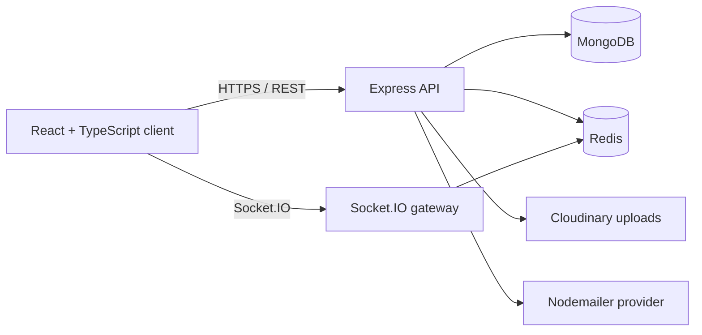

# Architecture

DevFlow is organized as a React single-page application and a versioned Express API. MongoDB owns durable product data; Redis supports caching, queueing, and horizontal realtime scaling.

## Backend layers

- Routes define the external HTTP contract.
- Controllers coordinate request-specific behavior.
- Services own business rules such as auth and audit creation.
- Repositories/models isolate persistence and indexing.
- Middleware handles authentication, RBAC, validation, observability, and error shaping.

## Security boundaries

Every protected request contains a verified user identity. Organization membership determines the active role, and all resources are filtered by organization ID. Production traffic must use HTTPS, secure cookies, rotating access/refresh tokens, and secret storage outside source control.
