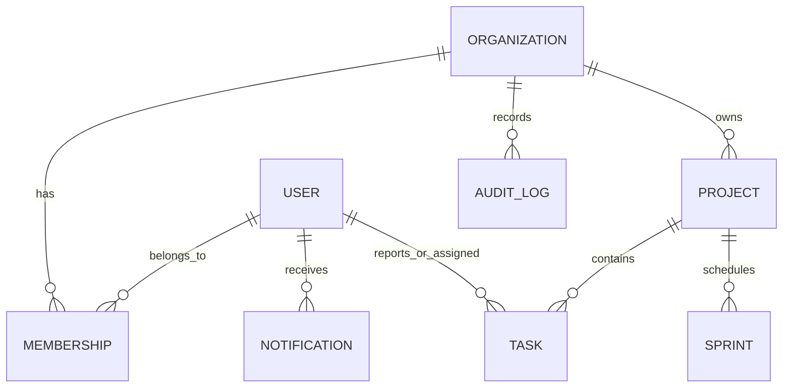

# Data Model

| Collection | Key fields | Important indexes |
|---|---|---|
| Users | email, passwordHash, profile | unique `email` |
| Organizations | name, slug, ownerId | unique `slug` |
| Memberships | organizationId, userId, role | unique compound organization/user |
| Projects | organizationId, key, leadId | unique compound organization/key |
| Tasks | projectId, number, status, position | unique project/number; board ordering |
| Sprints | projectId, dates, status | project/status |
| Notifications | userId, readAt | user/read state |
| AuditLogs | organizationId, actorId, action | organization/time |

All tenant-owned collections carry an `organizationId` or are reachable through an organization-scoped parent. That boundary must remain mandatory in every new query.
